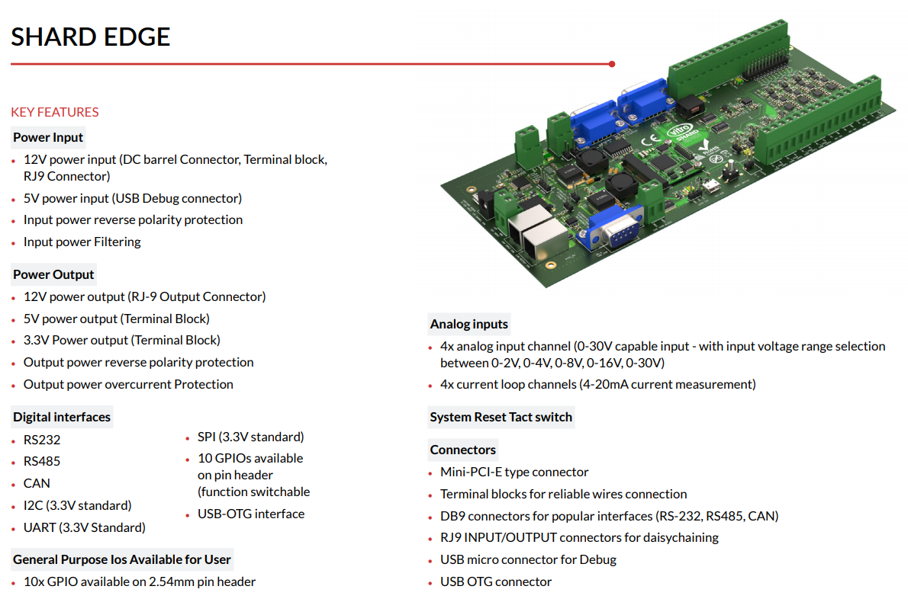

# shard-edge-schematics

This repository contains all manufacturing and documentation files related to
the Vitro Shard Edge carrier board project.

## Shard Edge

It is a carrier board equipped with multiple industry interfaces (e.g. RS232,
RS485, ADC, Current Loop, CAN) and low-level embedded interfaces (e.g. GPIO,
UART, SPI, I2C). It also has an mPCIe slot designed for Shard. Therefore, Shard
Edge extends the operation of Shard device and easily provides the previously
mentioned interfaces to the user. It allows attaching sensors and communication
channels to Shard. And like the Shard, individual Shard Edge is just an
expansion board without the capability to operate independently.

More information can be found in the project documentation service:
[https://docs.vitro.io/docs](https://docs.vitro.io/docs).

